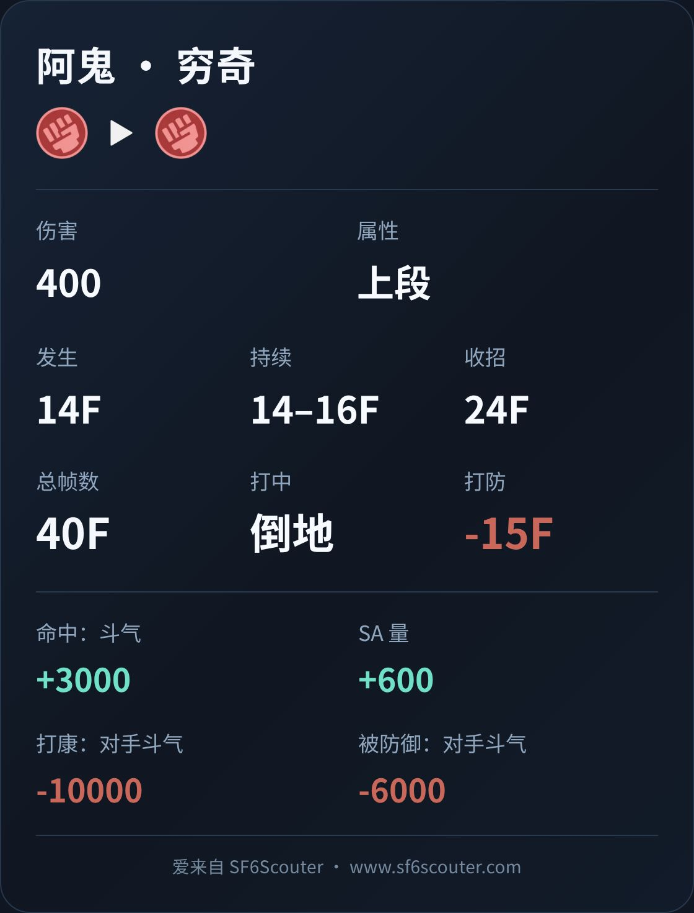
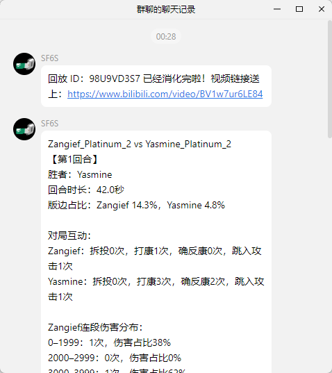

**English** | [简体中文](./README.md)

---

> **Notice**: This repository is exclusively used for publishing and storing release logs for the SF6S bot.

# SF6S Bot Features Overview

## Core Features

- **SF6 Frame Data Queries**: Query startup frames, block advantage, hitboxes, and damage data via character names (e.g. Akuma) and move aliases (e.g. 5hp, 236p, OD DP), rendered as HD image cards.
  - 🙌 Special thanks to QQ 太简单, QQ 焕冥, QQ 马肯博, QQ 悠哈, QQ 　, QQ 路德维C, QQ aaa 乐, QQ balance for data support

- **Replay Recording & Proactive Notifications**: Submit 9-character in-game replay IDs to trigger backend video recording. Automatically mention the submitter with the video link after publication on Bilibili.

- **Proactive Server Upgrade Notifications**: Notifies users during server version upgrades or system maintenance, keeping users informed of service status in real time.
  - 🙌 Special thanks to QQ 悠哈 for the suggestion

- **Friendly Prompts & Guidance**: Smart error correction and suggestions for unrecognized characters or moves; structured prompts and menu guides when @Bot is mentioned without inputs in group chats.
